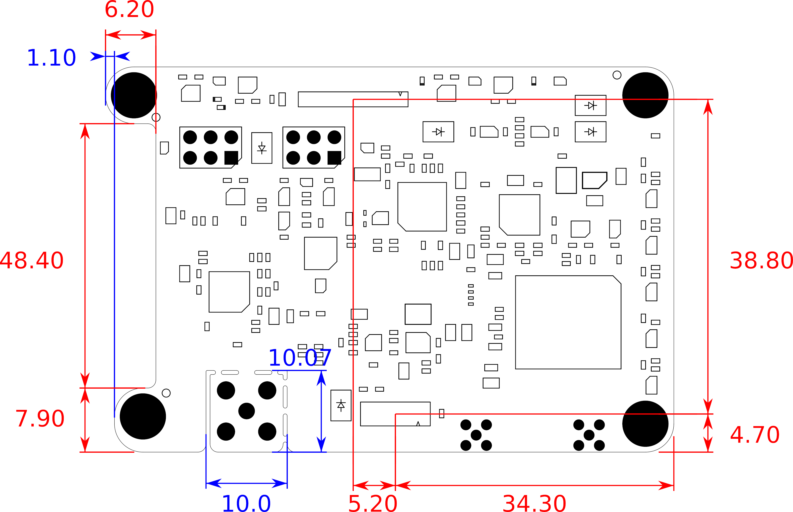

---

Author: [Filip Geib](https://www.linkedin.com/in/filipgeib/ "Filip's LinkedIn"), Maintainer: [septentrio-gnss](githubuser@septentrio.com "Manintainer's email")  
Website: https://github.com/septentrio-gnss/mowi  
License: [CC BY-SA 4.0](https://creativecommons.org/licenses/by-sa/4.0) & [OSHW Definition 1.0](https://www.oshwa.org/definition)  

---

# What is mowi?

**The mowi is an Open Source hardware project that combines a compact Septentrio's GNSS receiver *mosaic* with a wireless *ESP32 Wrover* module.** This extension enables mosaic to access wireless internet, receive remote commands, or use real-time corrections. The communication between the mosaic and the ESP is provided throughout a standard 802.3 Ethernet link. In-build USB HUB allows a user to connect to mowi with a single USB cable while accessing both the mosaic's and ESP's communication interface.

To support an easy-to-use evaluation and offer a high connectivity, the mowi exposes various interfaces. This includes four JST lock connectors compatible with Pixhawk, external GNSS, or other Septentrio's modules. Shared USB micro B port with an ESP dedicated autoflash circuitry for convenient programming. Support of single or dual antenna setup in MMCX or U.FL connectors. In-build eMMC device for easy data logging. And a separate SMA connector for an external WiFi/Bluetooth antenna. On top of that, the mowi comes with various perks, such as indication LEDs, selectable TTL voltages, or support for external sensors and other advanced circuitry.

---

# What is the mosaic module?

**[Mosaic modules](https://www.septentrio.com/en/products/gnss-receivers/rover-base-receivers/receivers-modules) are Septentrio's small-size and low-power GNSS receiver modules ideal for providing highly accurate positions.** Mosaic modules integrate the latest generation of GNSS technology, delivering highly accurate positions with minimal power consumption. While compact in size they fully retain the high-reliability and exceptional accuracy performance that Septentrio receivers are known for. True multi-frequency multi-constellation technology gives our module receivers access to every possible signal from all available GNSS satellite constellations including the U.S. GPS, European Galileo, Russian GLONASS, as well BeiDou, QZSS and NavIC. [Septentrio’s advanced field-proven algorithms](https://www.septentrio.com/en/company/septentrio-gnss-technology) exploit this signal diversity to deliver maximum positioning availability and reference network compatibility.

The mosaic's product range comes with four different versions. Their key features and differences are listed in the following table:

| GNSS modules | [**mosaic-X5**](https://www.septentrio.com/en/products/gnss-receivers/rover-base-receivers/receivers-modules/mosaic) | [**mosaic-H**](https://www.septentrio.com/en/products/gnss-receivers/rover-base-receivers/receivers-modules/mosaic-h) | [**mosaic-T**](https://www.septentrio.com/en/products/gnss-receivers/rover-base-receivers/receivers-modules/mosaic-t) | [**mosaic-Sx**](https://www.septentrio.com/en/products/gnss-receivers/rover-base-receivers/receivers-modules/mosaic-sx)
|:-:|:-:|:-:|:-:|:-:
| Use case | base/rover | heading | timing | built-in corrections
| Dual antenna |   | :white_check_mark: |   |
| Built-in corrections |   |   |   | :white_check_mark:
| Heading |   | :white_check_mark: |   |
| L-band | :white_check_mark: |   |   | :white_check_mark:
| RTK | :white_check_mark: | :white_check_mark: |   | :white_check_mark:
| Timing receiver |   |   | :white_check_mark: |

---

# How to produce mowi?

At this moment, no third party is known, to the author or Septentrio, to be selling manufactured versions of the mowi board. However, anyone can use the reference design in the form of the KiCad project and contact his preferred manufacturer for production. The mosaic GNSS modules can be obtained directly from Septentrio or Digi-Key. The mosaic's Digi-Key part numbers are [2771-410322-ND](https://www.digikey.com/en/products/detail/septentrio-inc/410322/12503897) for mosaic-X5 and [2771-410352-ND](https://www.digikey.com/en/products/detail/septentrio-inc/410352/14640203) for mosaic-H.

:information_source: In order to maintain the PCB's designed impedance matching, all of it's six layers should be manufactured in 35µm copper thickness.

Within this project, we have used the manufacturing and assembly services of Eurocircuits. In case of interest in using their services to produce the mowi, please find already processed production data in `.\fabrication\eurocircuits`.  These files can be uploaded directly to Eurocircuits and boost the process of PCB validation and assembly analysis.

:warning: **Disclaimer**: This project is **PROVIDED AS IS** and has not been fully validated nor by the author nor by Septentrio. It remains your responsibility when producing or using this design for your own purposes.

---

# Mowi user documentation
The following section lists the most important design specifications of the mowi board. For a detailed understanding, please refer to the schematic files in `.\schematic`.

## General interfaces
To support an easy-to-use evaluation and offer a high connectivity, the mowi exposes various interfaces.

* **USB interface** maintained by an onboard high-speed USB HUB. Its purpose is to enable mosaic or/and ESP connectivity via a single micro USB B cable. The communication between the HUB and the ESP is provided by an FTDI bridge chip, connected directly to the ESP's `UART0`. Additional auto-download circuitry is controlled by the FTDI chip enabling easy and convenient flashing. However, two **reset and boot buttons**, typical for the ESP applications, are available if a flash through UART is preferred or a manual reboot is needed.
* **JST lock connectors** serves as general and robust points of connectivity. Two of them are dedicated to the mosaic alone: i) a PIXHAWK compatible connector exposing the mosaic's `COM1` port with HW flow control, and ii) universal mosaic connector offering additional functionality of external trigger `EventA`, precise timekeeping with PPS output `PPSO` and communication via `COM3` port. The last JST connector is dedicated to ESP and exposes its `UART1` with HW flow control. One of the possible use cases for this connector is a link to an external GSM module.
* **Dual GNSS antenna** connectors enables mowi's use for applications required heading and pitch/roll information. The mowi is available with more robust MMCX connectors or their compact U.FL replacement. These options are exclusive - the mowi should be stuffed with one or other type of GNSS connectors.
* **External WiFi/Bt antenna** can be mounted on an onboard SMA connector. This option is available for mowis with IE variant of ESP Worover present. The active range of a wireless connection can be significantly improved in such a case, enabling more remote applications.
* **Indication LEDs** can be used to provide instant feedback of essential features such as power, position corrections, logging, and WiFi or Bluetooth connections status. Their right-angled packages are ideal for easy casing.
* **Additional breakout** of mosaic's and ESP's pins is present in two 2x3 2.54mm headers.

## Pinout
The images below show the pinout of the mowi’s connectors (and LEDs). Even though most of the labels follow the mosaic’s and ESP’s datasheets, the following remarks are required: LED `PWRLED` become active when the main 3.3V power line is active, LED `WIFILED` is driven by ESP's pin `IO12`, and LED `BTLED` is driven by ESP's pin `IO13`.

Expect the main connectors, two auxiliary 2.54mm headers are present. The `ADV` stands for 'advanced' and belongs to the mosaic, while `SENS` means 'sensors' and connects to the ESP. Remarks: `ESP SEN. VP` and `ESP SEN. VN` connect to the ESP’s `SENSOR_VP` and `SENSOR_VN` pins respectively, and are input only. Pins `ESP SCL` and `ESP SDA` are connected to ESP’s `IO14` and `IO15` respectively. They are labeled as an I2C data bus, however, they might be used as GPIOs. Mind the integrated 4.7k pullups on these I2C pins.

These images serve mostly as a fast lookup reference. For a proper understanding of internal wiring and connections, we recommend referring to schematic files in `.\schematic`.
 
## Power options, TTL and ESD

The mowi board can be powered with a **3.3V or 5V power supply** connected to any of the JST connectors or the USB port. The recommended **minimum power supply output current is 1.2A**. The maximal input current should not exceed 2.1A under any circumstances. The individual power input pins are connected to a single input power bus throughout series of diodes. An electronic fuse device continuously monitors this input bus for events of over voltage, over current, and a short circuit.

It is possible to **change TTL voltages** of signals break out to the JST `MSC`and `ESP` connectors, and the `ADV` header. This can be done using a **TTL selector switch** separately for pins assigned to the mosaic, and the ESP. The available voltage levels are 3.3V and 5V. Please mind, that the JST `PXH` connector and the `SENS` header are 3.3V TTL only. The image below illustrates the TTL switch positions, while the table sums TTL voltage options:

Connector | TTL option | TTL switch marking
--- | --- | :-:
JST `PXH` | 3.3V | na
JST `MSC` | 3.3V or 5V | `M`
JST `ESP` | 3.3V or 5V | `E`
`ADV` header | 3.3V or 5V | `M`
`SENS` header | 3.3V | na

All of the previously mentioned connectors together with the GNSS antenna connectors, and the USB port are **protected against ESD** events. The clamping voltage of protection devices is always set to the protected bus's maximal operational voltage. That means 3.3V for the `PXH` connector and the `SENS` header, and 5V in all other cases.
 
## Formfactor
The mowi's shape, size, and mounting are based on the AsteRx-m3 standard developed by Septentrio N.V. This formfactor compatibility enable mowi to be used with another Septentrio products, such as [AsteRx-i D UAS](https://www.septentrio.com/en/products/gnss-receivers/rover-base-receivers/gnss-ins-solutions/asterx-iduas) or [evaluation kit](https://shop.septentrio.com/en/shop/mosaic-h-gnss-heading-module-evaluation-kit-2-gnss-antennae). The drawing below defines the AsteRx-m3 formfactor overall size and mounting:

The following two drawings define mowi's shape and positions of individual connectors / LEDs:

  
  

  
All dimensions marked in the previous drawings are in millimeters. For the exact shape please refer to `.\designFiles\formfactor_top.svg` and `.\...\formfactor_bottom.svg`, or check directly the KiCad Pcbnew file `.\mowi\mowi.kicad_pcb`.

## Circuitry layout
Because of the formfactor size restrictions and a user-friendly layout, all of the supporting circuitry was placed from the bottom side of the mowi board. The only exception to this statement is the GNSS signal circuitry, populated and routed on the board's top side. This approach was determined by the controlled impedance requirements of this critical signal. The image below roughly illustrates the layout of separate subsystems:

Legend: `1A` and `1B` - Ethernet PHYs of mosaic and ESP, `2` - USB HUB, `3` - FTDI bridge of ESP, `4` - eMMC device of mosaic, `5A` and `5B` - 3.3V buck/boost converter with eFuse and 5V boost converter, `6` - signal logic gates, TTL voltage translators and ESD protection devices, `7` - LED drivers.

---
