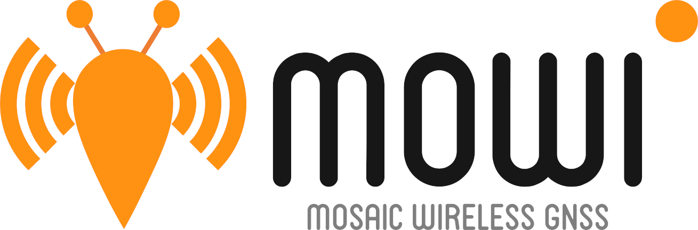
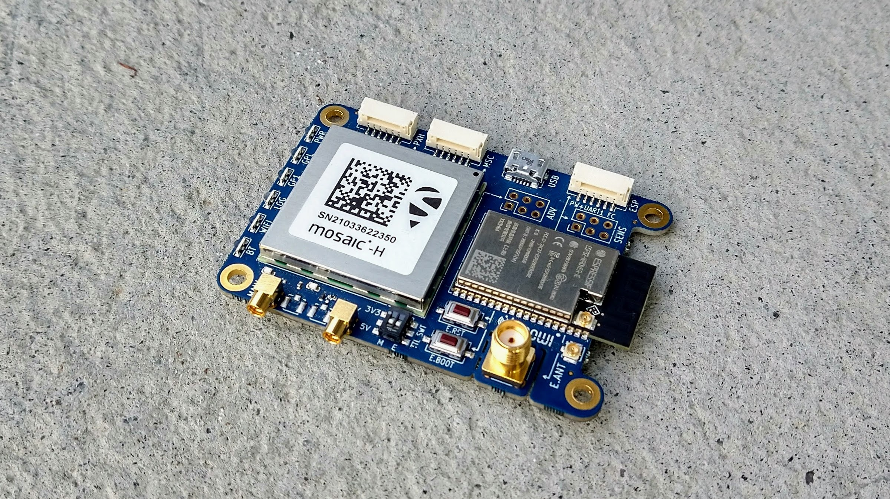
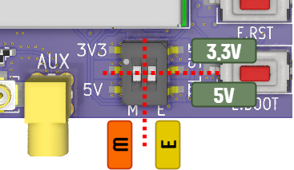
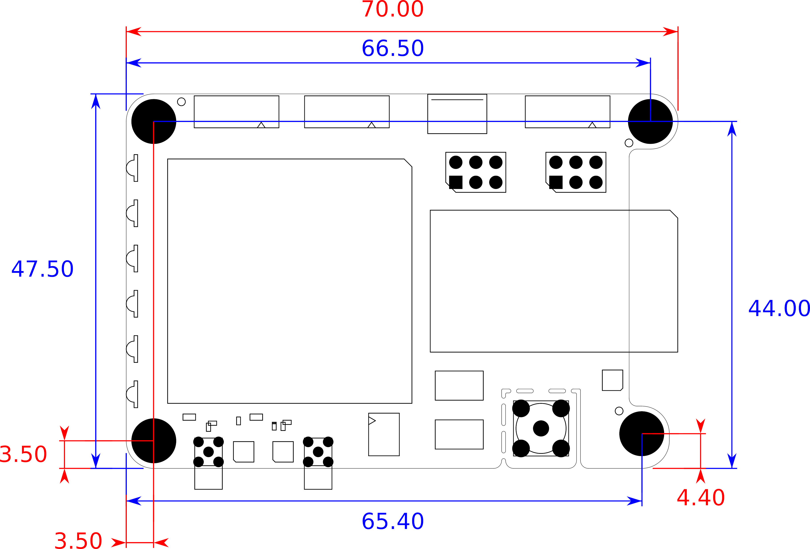
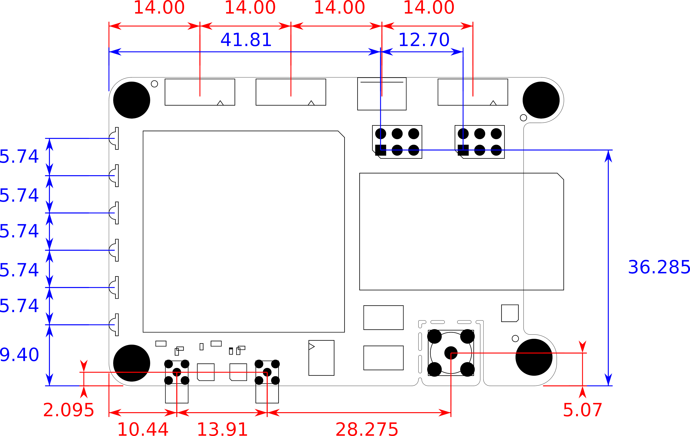

---

Author: [Filip Geib](https://www.linkedin.com/in/filipgeib/ "Filip's LinkedIn"), Maintainer: [septentrio-gnss](githubuser@septentrio.com "Manintainer's email")  
Website: https://github.com/septentrio-gnss/mowi  
License: [CC BY-SA 4.0](https://creativecommons.org/licenses/by-sa/4.0) & [OSHW Definition 1.0](https://www.oshwa.org/definition)  

---

# What is mowi?

**Mowi is an Open Source hardware project that combines a compact Septentrio's GNSS receiver *mosaic* with a wireless *ESP32 Wrover* module.** This extension enables mosaic to access wireless internet, receive remote commands, or use real-time corrections. The communication between the mosaic and the ESP is provided throughout a standard 802.3 Ethernet link. In-build USB HUB allows a user to connect to mowi with a single USB cable while accessing both the mosaic's and ESP's communication interface.

 

To support an easy-to-use evaluation and offer a high connectivity, the mowi exposes various interfaces. This includes four JST lock connectors compatible with Pixhawk, external GNSS, or other Septentrio's modules. Shared USB micro B port with an ESP dedicated autoflash circuitry for convenient programming. Support of single or dual antenna setup in MMCX or U.FL connectors. In-build eMMC device for easy data logging. And a separate SMA connector for an external WiFi/Bluetooth antenna. On top of that, the mowi comes with various perks, such as indication LEDs, selectable TTL voltages, or support for external sensors and other advanced circuitry.

 

---

# Table of contents

- [What is mowi?](#what-is-mowi)
- [Table of contents](#table-of-contents)
- [What is the mosaic module?](#what-is-the-mosaic-module)
- [How to set up mowi?](#how-to-set-up-mowi)
- [How to use mowi?](#how-to-use-mowi)
- [How to produce mowi?](#how-to-produce-mowi)
- [Housing](#housing)
- [Deliverables](#deliverables)
- [Mowi user documentation](#mowi-user-documentation)

---

# What is the mosaic module?
 
**[Mosaic modules](https://www.septentrio.com/en/products/gnss-receivers/rover-base-receivers/receivers-modules) are Septentrio's small-size and low-power GNSS receiver modules ideal for providing highly accurate positions.** Mosaic modules integrate the latest generation of GNSS technology, delivering highly accurate positions with minimal power consumption. While compact in size they fully retain the high-reliability and exceptional accuracy performance that Septentrio receivers are known for. True multi-frequency multi-constellation technology gives our module receivers access to every possible signal from all available GNSS satellite constellations including the U.S. GPS, European Galileo, Russian GLONASS, as well BeiDou, QZSS and NavIC. [Septentrio’s advanced field-proven algorithms](https://www.septentrio.com/en/company/septentrio-gnss-technology) exploit this signal diversity to deliver maximum positioning availability and reference network compatibility. The mosaic's product range comes with three different versions. Their key features and differences are listed in the following table:

 

| GNSS modules | [**mosaic-X5**](https://www.septentrio.com/en/products/gnss-receivers/rover-base-receivers/receivers-modules/mosaic) | [**mosaic-H**](https://www.septentrio.com/en/products/gnss-receivers/rover-base-receivers/receivers-modules/mosaic-h) | [**mosaic-T**](https://www.septentrio.com/en/products/gnss-receivers/rover-base-receivers/receivers-modules/mosaic-t) |
|:-:|:-:|:-:|:-:|
| Use case | base/rover | heading | timing |
| Dual antenna |   | :heavy_check_mark: |
| Heading |   | :heavy_check_mark: |
| L-band | :heavy_check_mark: |   |
| RTK | :heavy_check_mark: | :heavy_check_mark: |   |
| Timing receiver |   |   | :heavy_check_mark: |

---

# How to set up mowi?

## Basic hardware setup

Few external attachments have to be provided to enable mowi's full functionality. The following list sums them up. Note that it is not necessary to follow the order.
 1. Attach a short U.FL to U.FL cable to ESP Wrover's WiFi antenna connector and mowi's U.FL WiFi connector near `E.ANT` designator.
 2. Screw a WiFi antenna to mowi's WiFi SMA connector designated as `E.ANT`. This antenna should be explicitly designed for the 2.4 GHz band and facilitate a male SMA connector.
 3. Connect a GNSS antenna to mowi's primary MMCX connector designated as `MAIN`. An ordinary talisman antenna was used through the following examples.
 4. (optional, only for mowi with mosaic-H): Connect a GNSS antenna to mowi's secondary MMCX connector designated as `AUX`.

 

:information_source: Steps 1. and 2. can be skipped when mowi with the ESP32-WROVER-E module is used. As this module facilitates an inbuild WiFi antenna, there is no need for an external one.

## Basic connection

The easiest way of communicating with mowi is through its USB interface. This example shows how to do so step by step while illustrating and explaining some basic functionality of the mosaic and ESP modules.

Connect mowi to your PC using a USB micro-B cable. Once attached, you should be able to see three new USB devices in your system. If you are using Linux, their drivers are installed automatically. On a Windows machine, you have to install one of the drivers manually. Download and install [CP210x Universal Windows Driver](https://www.silabs.com/developers/usb-to-uart-bridge-vcp-drivers) from the ESP's UART bridge manufacturer website. After doing so, you can check these new USB devices in Windows Device Manager. On Linux, open a terminal and run `lsusb` command. You should see something similar to the following image, where the unblurred devices correspond respectively to i) ESP's UART bridge, ii) mosaic module, and iii) mowi's USB HUB:

 

By default, the mosaic module supports Ethernet-over-USB. Therefore the easiest way how to access its information and configuration is through your internet browser. To do so, simply open the [`192.168.3.1.`](192.168.3.1.) IP address in your favorite browser and automatically enter the mosaic's web interface. In a case of a happily running mowi, you should see something similar:

 

Another simple option of communication with the mosaic module is through its COM ports. These ports should be visible in your system as `ACM0` and `ACM1`. Use your favorite serial terminal (such as Putty or Moserial) and the following settings to establish a connection:

| port | baud rate | data bits | stop bits | parity | flow control |
|:---:|:---:|:---:|:---:|:---:|:---:|
| ACM0 / ACM1 | 115200 | 8 | 1 | no | none |

Now you can command mosaic with a command line interface outline. For more information about syntax, replies, and commands tables, check section 3.1 in mosaic-X5 Reference Guide. To quickly test this interface, you can command mosaic to turn the `GP1` LED on and off. To do so, send the following two commands throughout the serial terminal:

`$ sgpf, GP1, Output, none, LevelHigh` 
`$ sgpf, GP1, Output, none, LevelLow`

Not only the green `GP1` LED goes on and off again, but you should also see the following mosaic's response in your serial terminal:

 

After successfully establishing communication with mosaic, the ESP module is the last remaining challenge. Thanks to the mowi's inbuild UART bridge, the communication can be established through a `USB0` COM port. Use again your favorite serial terminal with the following parameters:

| port | baud rate | data bits | stop bits | parity | flow control |
|:---:|:---:|:---:|:---:|:---:|:---:|
| USB0 | 115200 | 8 | 1 | no | none |

After establishing this connection, you should be able to receive debug data from the ESP module. By default (from factory), the ESP32-WROVER is flashed with [Espressive's ESP-AT command firmware](https://github.com/espressif/esp-at). To quickly test this interface, you can press the ESP's reset button designated by `E.RST`. After doing so, you should see a reboot log similar to this one:

 

:information_source: On Windows systems, mosaic's and ESP's ports are usually named `COMx`, where `x` stands for a randomly assigned number. Use `Control Panel >> Device Manager >> Ports` to determine which USB device is linked o which port (or brute-force it).

:information_source: The Espressive's ESP-AT firmware does not support the ESP's UART0 by default. Therefore, sending AT commands through the USB interface with the ESP's default factory firmware is impossible.

## Flashing ESP

The true potential of mowi lies in running custom firmware on the ESP module. The most convenient way is to flash ESP with an already compiled binary image using Espressive's official `esptool.py` utility. If you are interested in building your own firmware, please skip to the following example (`Developing ESP firmware`) as it handles the flashing process for you.

To start flashing, you have to install the esptool utility. You can do so from [pypi repository](https://pypi.org/project/esptool/) by using the pip packet management system. Mind that you need Python 2.7 or Python 3.4 or newer installed on your computer. For more details or to troubleshoot problems, visit the [esptool's GitHub repository](https://github.com/espressif/esptool/). To install the esptool run the following command in your terminal:

`$ pip install esptool`

During experimenting with ESP, it might be useful to re-flash it with the default (factory) firmware known as [ESP-AT](https://github.com/espressif/esp-at). To download this firmware go to its [official GitHub repository](https://github.com/espressif/esp-at/releases/tag/v2.2.0.0_esp32) and download the `.zip` folder dedicated to ESP32-WROVER module. After unzipping it, enter the `.\factory` subfolder and search for `factory_WROVER-32.bin`. This is the binary image you are about to flash to your ESP. To do so, connect your mowi to your computer via the USB cable and execute the following command in your terminal:

`$ esptool.py --chip auto --port /dev/ttyUSB0 --baud 115200 write_flash -z 0x0 factory_WROVER-32.bin`

Where `--port` specifies a serial port to which ESP is connected, `--baud` is the default baud-rate, `0x0` is a targeted memory address, and `factory_WROVER-32.bin` is the binary image you are flashing to ESP. After successful flashing, you should see a similar log in your terminal. The `Hash of data verified.` message means that the flashed image was successfully verified.

 

:information_source: Mowi's built-in auto-download circuitry will set the appropriate boot mode and reset the ESP module for you. If you wish to control these processes manually, use two tactile switches designated as `E.RST` and `E.BOOT`. Holding down `E.BOOT` and then pressing `E.RST` initiates firmware download. Standalone press of `E.RST` resets the ESP module.

:information_source: The previous flash command is a minimal working example. For advanced flashing, please refer to [flash modes in the esptool's manual](https://github.com/espressif/esptool/#flash-modes). A more robust flashing can be executed with this command:
 
`$ esptool.py --chip auto --port /dev/ttyUSB0 --baud 115200 --before default_reset --after hard_reset write_flash -z --flash_mode dio --flash_freq 40m --flash_size 4MB 0x0 factory_WROVER-32.bin`

---

# How to use mowi?

In this project, we provide not only the hardware design but also an example firmware. These examples are intended to demonstrate key features of mowi and deliver code that can be further used and modified. Espressifs [ESP-IDF](https://docs.espressif.com/projects/esp-idf/en/latest/esp32/index.html) is used as a development framework. The following examples are currently available:
- `examples/mowi_wifi_basic` WiFi to Ethernet packet forwarding
- `examples/mowi_wifi_client` WiFi to Ethernet packet forwarding with BLE based Provisioning

## Basic WiFi connection

An example named `mowi_wifi_basic` extends mosaic with full access to wireless internet by transparently forwarding internet packets. 

 

The objective is to demonstrate how to set up an internet packet forwarding between mosaic's Ethernet and ESP's WiFi with respect to mosaic's MAC address. The ESP module is configured as a WiFi station connecting to a WiFi access point and forwarding all traffic to and from mosaic's Ethernet port. No actions are performed by ESP on layer 3 and higher layers. It is therefore expected that the targeted WiFi access point runs a DHCP server.

The step-by-step functionality of this example can be described as follows:
1. Initialize ESP's Ethernet driver and PHY chip.
2. Configure mosaic's Ethernet through UART commands.
3. Mask ESP's MAC address with the mosaic's one.
4. Connect to the desired WiFi access point.
5. Forward all internet traffic and maintain the connection.

To run this example, you need to flash mowi with provided firmware. Credentials of the targeted WiFi access point are hardcoded in this case to `mowi_wifi_accpoint` as an SSID and `mowi_rocks` as a password. If you are okay with it, you can directly flash provided binaries. If not, you can easily modify the `menuconfig` file and recompile the code. Please refer to [steps 7 to 9 of ESP-IDF Get Started](https://docs.espressif.com/projects/esp-idf/en/latest/esp32/get-started/#step-7-configure) for more information.

After a successful connection to WiFi (indicated by the blue`WIFI` LED), you can reach the mosaic's WEB interface through an IP address assigned by the DHCP server. To figure it out, you can:
- Look into the `Communication >> Ethernet` section of the mosaic's WEB interface through the USB connection.
- Inspect your WiFi access point device (router, smartphone, etc.) settings/info.
- Send a `$ getIPSettings` command to mosaic through one of the provided COM ports.
- Search the example log streamed to the port used during flashing. Look for a log similar to this one: `mowi_wifi_basic: WiFi connected with IP Address:192.168.43.189`

To flash the provided binaries, connect mowi to your computer, navigate to `examples/mowi_wifi_basic/build`, and execute the following command (replace `PORT` accordingly to your system):

`esptool.py -p PORT -b 460800 --before default_reset --after hard_reset --chip esp32 write_flash --flash_mode dio --flash_freq 40m --flash_size detect 0x10000 mowi_wifi_basic.bin 0x1000 bootloader/bootloader.bin 0x8000 partition_table/partition-table.bin`

## Client WiFi connection

An example named `mowi_wifi_client` adds a Bluetooth based WiFi provisioning to the previously `mowi_wifi_basic` example.

A drawback of the previous example is its hardcoded WiFi access point SSID and password. In some applications, it might be beneficial to change WiFi credentials to-go instead of recompiling and reflashing the firmware. In this example, we illustrate how to use Espressives [Unified Provisioning API](https://docs.espressif.com/projects/esp-idf/en/latest/esp32/api-reference/provisioning/provisioning.html) to set up ESP's targeted access point through Bluetooth with a smartphone. This is done via the Espressives BLE app available at:
- Android: [BLE Provisioning app on Play Store](https://play.google.com/store/apps/details?id=com.espressif.provble)
- iOS: [BLE Provisioning app on app store](https://apps.apple.com/in/app/esp-ble-provisioning/id1473590141)

To start with this example, open the BLE Provisioning app and click on `Provision New Device`. There are two different ways how to proceed. The first one is thoughts scanning QR codes generated by ESP. This code is displayed in its firmware log. Connect mowi to your computer through the USB and open the ESP's COM port in your favorite serial terminal. Press the` E.RST` button to reboot the ESP module. After a while, your log stream should stop and display a similar QR code:

 

The second option is through searching for available Bluetooth devices. Press `I don't have a QR code` and wait for the search to complete. You should see your mowi listed as `PROV_MOWI_MAC` where `MAC` is your mowi's actual MAC address. Click on it and just confirm the default proof of possession PIN (`abcd1234`) by pressing `Next`. 

After this successful connection, the ESP module will automatically search for available WiFi networks and report findings to your BLE app. Now you just have to select your desired WiFi network and enter its password. The ESP module will then automatically connect to it and forwards all internet packets to and from the mosaic. An example of both Bluetooth and WiFi network searches could be:

 
 

It is recommended to erase flash specially if mowi had been already flashed before. You can do this by using the following command:
esptool.py -p PORT erase_flash

To flash the provided binaries, connect mowi to your computer, navigate to `examples/mowi_wifi_client/build`, and execute the following command (replace `PORT` accordingly to your system):

`esptool.py -p PORT -b 460800 --before default_reset --after hard_reset --chip esp32 write_flash --flash_mode dio --flash_freq 40m --flash_size detect 0x10000 mowi_wifi_client.bin 0x1000 bootloader/bootloader.bin 0x8000 partition_table/partition-table.bin`

---

# How to produce mowi?

At this moment, no third party is known, to the author or Septentrio, to be selling manufactured versions of the mowi board. However, anyone can use the reference design in the form of the KiCad project and contact his preferred manufacturer for production. The mosaic GNSS modules can be obtained directly from Septentrio or Digi-Key. The mosaic's Digi-Key part numbers are [2771-410322-ND](https://www.digikey.com/en/products/detail/septentrio-inc/410322/12503897) for mosaic-X5 and [2771-410352-ND](https://www.digikey.com/en/products/detail/septentrio-inc/410352/14640203) for mosaic-H.

:information_source: In order to maintain the PCB's designed impedance matching, all of it's six layers should be manufactured in 35µm copper thickness.

Within this project, we have used the manufacturing and assembly services of Eurocircuits. In case of interest in using their services to produce the mowi, please find already processed production data in `.\fabrication\eurocircuits`.  These files can be uploaded directly to Eurocircuits and boost the process of PCB validation and assembly analysis.

:warning: **Disclaimer**: This project is **PROVIDED AS IS** and has not been fully validated nor by the author nor by Septentrio. It remains your responsibility when producing or using this design for your own purposes.

---

# Housing

A 3D model of mowi's housing designed to be printed by a 3D printer is available in `mowi/designFiles/housing`. Two `STL` files: `mowi_topprint_housing.stl` and `mowi_lowerprint_housing.stl` can be loaded directly into a slicer software. The model can be used with for `M3x8` screws that would self-thread into the plastic. If needed, brass threaded inserts can be added with a simple modification of the holes in the top `mowi_topprint_housing.stl`. Holes for LED's are not included in the model as many 3D printers are not very good at these small details. If needed, the hole can be drilled after printing or added to the `STL` model. Overall, this should be quite a simple print.

 

This housing was designed and evaluated by [Silviu Taujan](https://www.linkedin.com/in/silviutaujan/ "Silviu's LinkedIn") as a contribution to the mowi project.

---

# Deliverables

This project makes the following deliverables for both integrators and designers of systems around Septentrio's mosaic modules.

| **Path** | **Description** |
|:--|:--|
| `mowi/3Doutput/` | Rendered `RWL` and `STP` 3D models of the mowi. Basic `.png` exports included. |
| `mowi/designFiles/` | Efuse calculator `.xlsm` scheet, mowi's formfactor `.svg` templates and `STP` 3D models of housing ready to be printed. |
| `mowi/fabrication/boms/` | Vanilla KiCad and slightly modified `.csv` bills of material togehter with [InteractiveHtmlBom](https://github.com/openscopeproject/InteractiveHtmlBom) `.html` bom. |
| `mowi/fabrication/eurocircuits/` | Should include ready-to-order [EuroCircuits](https://www.eurocircuits.com/) files in the recent feature. |
| `mowi/fabrication/gerbers/` | Exported gerber files of the mowi board. |
| `mowi/library/Septentrio_<xxx>.pretty/` | Septentrio's KiCad footprints libraries divided into groups denoted by `<xxx>`. |
| `mowi/library/Septentrio_packages3D/` | `STP` 3D models linked to Septentrio's KiCad footprints libraries. |
| `mowi/library/Septentrio_symbols/` | Septentrio's KiCad symbols library. |
| `mowi/readmeSource/` | Source files for this readme file. |
| `mowi/schematic/` | Electrical schematics `.pdf` export. Separate sheets and merged version present. |

---

# Mowi user documentation
The following section lists the most important design specifications of the mowi board. For a detailed understanding, please refer to the schematic files in `.\schematic`.

## General interfaces
To support an easy-to-use evaluation and offer a high connectivity, the mowi exposes various interfaces.

 

 
* **USB interface** maintained by an onboard high-speed USB HUB. Its purpose is to enable mosaic or/and ESP connectivity via a single micro USB B cable. The communication between the HUB and the ESP is provided by an FTDI bridge chip, connected directly to the ESP's `UART0`. Additional auto-download circuitry is controlled by the FTDI chip enabling easy and convenient flashing. However, two **reset and boot buttons**, typical for the ESP applications, are available if a flash through UART is preferred or a manual reboot is needed.
* **JST lock connectors** serves as general and robust points of connectivity. Two of them are dedicated to the mosaic alone: i) a PIXHAWK compatible connector exposing the mosaic's `COM1` port with HW flow control, and ii) universal mosaic connector offering additional functionality of external trigger `EventA`, precise timekeeping with PPS output `PPSO` and communication via `COM3` port. The last JST connector is dedicated to ESP and exposes its `UART1` with HW flow control. One of the possible use cases for this connector is a link to an external GSM module.
* **Dual GNSS antenna** connectors enables mowi's use for applications required heading and pitch/roll information. The mowi is available with more robust MMCX connectors or their compact U.FL replacement. These options are exclusive - the mowi should be stuffed with one or other type of GNSS connectors.
* **External WiFi/Bt antenna** can be mounted on an onboard SMA connector. This option is available for mowis with IE variant of ESP Worover present. The active range of a wireless connection can be significantly improved in such a case, enabling more remote applications.
* **Indication LEDs** can be used to provide instant feedback of essential features such as power, position corrections, logging, and WiFi or Bluetooth connections status. Their right-angled packages are ideal for easy casing.
* **Additional breakout** of mosaic's and ESP's pins is present in two 2x3 2.54mm headers.

## Pinout
The images below show the pinout of the mowi’s connectors (and LEDs). Even though most of the labels follow the mosaic’s and ESP’s datasheets, the following remarks are required: LED `PWRLED` become active when the main 3.3V power line is active, LED `WIFILED` is driven by ESP's pin `IO12`, and LED `BTLED` is driven by ESP's pin `IO13`.

 

Expect the main connectors, two auxiliary 2.54mm headers are present. The `ADV` stands for 'advanced' and belongs to the mosaic, while `SENS` means 'sensors' and connects to the ESP. Remarks: `ESP SEN. VP` and `ESP SEN. VN` connect to the ESP’s `SENSOR_VP` and `SENSOR_VN` pins respectively, and are input only. Pins `ESP SCL` and `ESP SDA` are connected to ESP’s `IO14` and `IO15` respectively. They are labeled as an I2C data bus, however, they might be used as GPIOs. Mind the integrated 4.7k pullups on these I2C pins.

 

These images serve mostly as a fast lookup reference. For a proper understanding of internal wiring and connections, we recommend referring to schematic files in `.\schematic`.
 
## Power options, TTL and ESD

The mowi board can be powered with a **3.3V or 5V power supply** connected to any of the JST connectors or the USB port. The recommended **minimum power supply output current is 1.2A**. The maximal input current should not exceed 2.1A under any circumstances. The individual power input pins are connected to a single input power bus throughout series of diodes. An electronic fuse device continuously monitors this input bus for events of over voltage, over current, and a short circuit.

It is possible to **change TTL voltages** of signals break out to the JST `MSC`and `ESP` connectors, and the `ADV` header. This can be done using a **TTL selector switch** separately for pins assigned to the mosaic, and the ESP. The available voltage levels are 3.3V and 5V. Please mind, that the JST `PXH` connector and the `SENS` header are 3.3V TTL only. The image below illustrates the TTL switch positions, while the table sums TTL voltage options:

 

 
Connector | TTL option | TTL switch marking
--- | --- | :-:
JST `PXH` | 3.3V | na
JST `MSC` | 3.3V or 5V | `M`
JST `ESP` | 3.3V or 5V | `E`
`ADV` header | 3.3V or 5V | `M`
`SENS` header | 3.3V | na

All of the previously mentioned connectors together with the GNSS antenna connectors, and the USB port are **protected against ESD** events. The clamping voltage of protection devices is always set to the protected bus's maximal operational voltage. That means 3.3V for the `PXH` connector and the `SENS` header, and 5V in all other cases.
 
## Formfactor
The mowi's shape, size, and mounting are based on the AsteRx-m3 standard developed by Septentrio N.V. This formfactor compatibility enable mowi to be used with another Septentrio products, such as [AsteRx-i D UAS](https://www.septentrio.com/en/products/gnss-receivers/rover-base-receivers/gnss-ins-solutions/asterx-iduas) or [evaluation kit](https://shop.septentrio.com/en/shop/mosaic-h-gnss-heading-module-evaluation-kit-2-gnss-antennae). The drawing below defines the AsteRx-m3 formfactor overall size and mounting:

 

The following two drawings define mowi's shape and positions of individual connectors / LEDs:

 
 

All dimensions marked in the previous drawings are in millimeters. For the exact shape please refer to `.\designFiles\formfactor_top.svg` and `.\...\formfactor_bottom.svg`, or check directly the KiCad Pcbnew file `.\mowi\mowi.kicad_pcb`.

## Circuitry layout
Because of the formfactor size restrictions and a user-friendly layout, all of the supporting circuitry was placed from the bottom side of the mowi board. The only exception to this statement is the GNSS signal circuitry, populated and routed on the board's top side. This approach was determined by the controlled impedance requirements of this critical signal. The image below roughly illustrates the layout of separate subsystems:

 

Legend: `1A` and `1B` - Ethernet PHYs of mosaic and ESP, `2` - USB HUB, `3` - FTDI bridge of ESP, `4` - eMMC device of mosaic, `5A` and `5B` - 3.3V buck/boost converter with eFuse and 5V boost converter, `6` - signal logic gates, TTL voltage translators and ESD protection devices, `7` - LED drivers.

---
